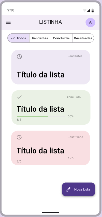

# Listinha

Application to create several lists to be used simultaneously and synchronized in the cloud after the data is saved locally (**Offline-first**).

# 1. Features

1. Authentication as simple as possible.
2. Register several different lists.
3. Select and deselect items by repositioning the deselected ones.
4. Synchronize data in the cloud.
5. Authenticated user editing.
6. Device configuration.

## 1.1 Authentication as simple as possible

Authentication is required to perform synchronization and should be optional, i.e. requested when the user manually performs synchronization.
The application must support "passwordless" authentication (**Passwordless**) by sending the token by email to access it. 

## 1.2 Register several different lists.

The user will be able to create a limited number of shopping lists, showing the total list information such as: List name, R$ value (if any) and status in card form.

List statuses should be: Pending, Completed, Deactivated.

The user can filter the lists by status.

## 1.3 Select and deselect items by repositioning the deselected ones.

Each list will need to divide the checked items from the unchecked ones and give the user the option of repositioning the unchecked items.

## 1.4 Synchronize data in the cloud.

All lists and their data will be stored locally on the user's device and then synchronized in the cloud. Synchronization should be automatic and attempts to synchronize in the event of a failure should be made every few minutes. This last point is important for saving battery power on mobile devices.

## 1.5 Authenticated user issue.

If authenticated, the user should be able to change information such as First name, Last name and profile picture.

## 1.6 Device configuration.

The app should have options for theme control and cache removal.

# 2. User Experience

The entire interface will be made using pre-built Material Design 3 components.
Mockup, font and asset information is available on Figma.

[Link Figma](https://www.figma.com/file/xSoyauWGMb25dsQCBrhPa5/Listinha?node-id=53095%3A27267&t=9eobg3NOs476wXmo-1)

# 3. Architecture

[General](ARCHITECTURE.md)
